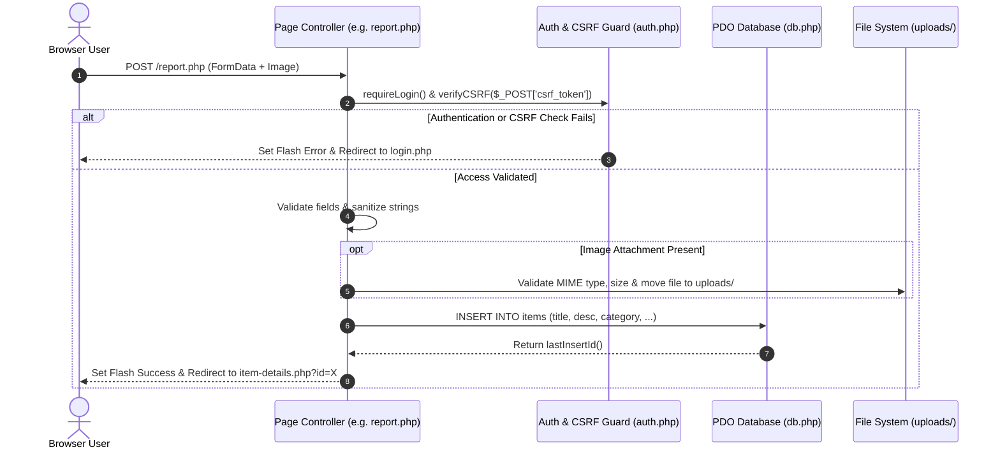

# Application Architecture & Design System

This document describes the software architecture, technical design patterns, request lifecycle, security mechanisms, and module organization for the University Online Lost and Found System.

---

## Architectural Pattern: MVC-Like Modular PHP Structure

The project follows a pragmatic, lightweight **Model-View-Controller (MVC-like)** architecture tailored for native PHP and MySQL applications.

```
       ┌────────────────────────────────────────────────────────┐
       │                      HTTP Request                      │
       └───────────────────────────┬────────────────────────────┘
                                   │
                                   ▼
       ┌────────────────────────────────────────────────────────┐
       │                   Page Controllers                     │
       │    (index.php, report.php, item-details.php, etc.)      │
       └──────┬────────────────────┬────────────────────┬───────┘
              │                    │                    │
              ▼                    ▼                    ▼
   ┌────────────────────┐┌──────────────────┐┌──────────────────┐
   │ Authentication     ││ Data Layer       ││ View Layer       │
   │ & Security Helpers ││ (PDO / MySQL)    ││ (HTML / CSS / JS)│
   │ (auth.php)         ││ (db.php)         ││ (includes/)      │
   └────────────────────┘└──────────────────┘└──────────────────┘
```

### Component Layers

1. **Controller Layer (Page Scripts)**:
   - File locations: `index.php`, `report.php`, `item-details.php`, `register.php`, `login.php`, `admin/*.php`.
   - Responsibilities: Processes incoming `GET`/`POST` HTTP requests, validates input parameters, invokes database operations, handles session redirection, and feeds data into views.

2. **Model & Database Access Layer**:
   - File location: `db.php`
   - Responsibilities: Manages database connections using PHP Data Objects (`PDO`). Utilizes prepared SQL statements to guarantee protection against SQL injection vulnerabilities. Parses environment variables from `.env`.

3. **Authentication & Security Layer**:
   - File location: `auth.php`
   - Responsibilities: Handles session management (`session_start()`), user authentication checks (`isLoggedIn()`, `isAdmin()`), authorization guards (`requireLogin()`, `requireAdmin()`), CSRF token generation/verification (`generateCSRF()`, `verifyCSRF()`), input sanitization (`sanitize()`), and flash messaging.

4. **View Layer (Presentation)**:
   - File locations: `includes/header.php`, `includes/footer.php`, `includes/nav.php`, `css/main.css`, `js/main.js`.
   - Responsibilities: Renders responsive user interfaces using HTML5, modern CSS custom properties (variables), and vanilla JavaScript for dynamic components (modals, search filters, image previews).

---

## End-to-End Request Lifecycle Flow



---

## Authentication & Session Architecture

### Session Lifecycle

- Sessions are initialized across all entry points via `auth.php`:
  ```php
  if (session_status() === PHP_SESSION_NONE) {
      session_start();
  }
  ```
- User identity is stored in `$_SESSION['user_id']`, `$_SESSION['username']`, and `$_SESSION['role']`.

### Password Hashing

- Password creation and verification use PHP's native `password_hash()` and `password_verify()` API:
  - **Algorithm**: `PASSWORD_BCRYPT` (Cost factor: 10)
  - Raw passwords are never logged or stored in plain text.

### Cross-Site Request Forgery (CSRF) Protection

- Forms include hidden CSRF token inputs (`generateCSRF()`):
  ```html
  <input type="hidden" name="csrf_token" value="<?= generateCSRF() ?>">
  ```
- Controllers evaluate tokens on `POST` requests via `verifyCSRF($_POST['csrf_token'])` using `hash_equals()` to protect against timing attacks.

---

## File Upload Flow

When users upload item photos (during item reporting or updates):

1. **Client-Side Validation**:
   - Preview image prior to submission via `js/main.js`.
   - HTML form specifies `enctype="multipart/form-data"`.

2. **Server-Side Validation**:
   - **MIME Type Checking**: Verifies image MIME types (`image/jpeg`, `image/png`, `image/webp`).
   - **Extension Verification**: Ensures extensions match allowed image extensions (`.jpg`, `.jpeg`, `.png`, `.webp`).
   - **File Size Limit**: Restricts file size to max 5MB (`5 * 1024 * 1024` bytes).

3. **Unique File Naming & Storage**:
   - Generates a unique collision-free filename using timestamp and random hex:
     ```php
     $filename = time() . '_' . bin2hex(random_bytes(8)) . '.' . $extension;
     ```
   - Stores the binary file in the `uploads/` directory.
   - Saves the relative path (`uploads/filename.jpg`) into the `items.image_path` database record.

---

## Authorization & Admin Access Control

Role-Based Access Control (RBAC) categorizes users into two distinct roles:
- `user`: General campus student / faculty member.
- `admin`: System administrator (e.g., University Lost & Found cell operator).

```
                      +-------------------+
                      | Incoming Request  |
                      +---------+---------+
                                |
                                ▼
                       Is User Logged In?
                      /                  \
                    NO                    YES
                   /                        \
      Redirect to login.php            Is Role == 'admin'?
                                      /                   \
                                    NO                     YES
                                   /                         \
                      Redirect to index.php         Grant Access to Admin Route
```

### Authorization Helpers (`auth.php`)

- **`requireLogin()`**: Ensures user is logged in; redirects unauthenticated visitors to `login.php` with a flash message.
- **`requireAdmin()`**: Enforces admin privileges; blocks non-admin users and redirects them to `index.php` with an access denied alert.

---

## Security Practices Summary

- **SQL Injection Prevention**: All queries pass through PDO prepared statements with parameter binding.
- **XSS Protection**: User-generated output rendered in HTML templates is escaped using `sanitize()` (`htmlspecialchars(..., ENT_QUOTES, 'UTF-8')`).
- **CSRF Protection**: Token validation on state-modifying `POST` actions.
- **HTTP Header Hardening**: Protection against clickjacking (`X-Frame-Options`) and MIME sniffing.
