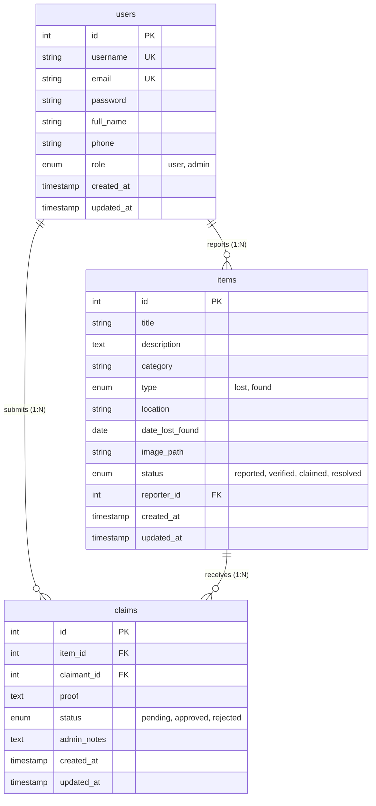

# Database Architecture & Schema Documentation

This document describes the database schema, relational structure, indexes, and entity-relationship diagrams for the University Online Lost and Found System database (`lost_and_found_db`).

---

## Database Overview

- **Database Name**: `lost_and_found_db`
- **Database Engine**: MySQL / InnoDB
- **Character Set**: `utf8mb4`
- **Collation**: `utf8mb4_unicode_ci` / `utf8mb4_general_ci`
- **Total Tables**: 3 (`users`, `items`, `claims`)

---

## Entity Relationship (ER) Diagram

### Text-Based / Mermaid Representation



### ASCII Schema Flow

```
 +------------------+            +------------------+
 |      USERS       |            |      ITEMS       |
 +------------------+            +------------------+
 | id (PK)          |1          *| id (PK)          |
 | username (UK)    |------------| reporter_id (FK) |
 | email (UK)       |            | title            |
 | password         |            | category         |
 | full_name        |            | type             |
 | phone            |            | location         |
 | role             |            | date_lost_found  |
 +------------------+            | image_path       |
          |                      | status           |
          |                      +------------------+
          | 1                             | 1
          |                               |
          | *                             | *
 +--------------------------------------------------+
 |                      CLAIMS                      |
 +--------------------------------------------------+
 | id (PK)                                          |
 | item_id (FK -> items.id)                         |
 | claimant_id (FK -> users.id)                     |
 | proof                                            |
 | status                                           |
 | admin_notes                                      |
 +--------------------------------------------------+
```

---

## Table Structure & Field Specifications

### 1. `users` Table

Stores account information for students, faculty, and system administrators.

| Column Name | Data Type | Nullable | Default | Description & Constraints |
|---|---|---|---|---|
| `id` | `INT` | No | Auto Increment | Primary Key |
| `username` | `VARCHAR(50)` | No | *None* | Unique account handle |
| `email` | `VARCHAR(100)` | No | *None* | Unique campus email address |
| `password` | `VARCHAR(255)` | No | *None* | Bcrypt hashed password (`password_hash`) |
| `full_name` | `VARCHAR(100)` | No | `''` | User's complete full name |
| `phone` | `VARCHAR(20)` | Yes | `NULL` | Contact phone number |
| `role` | `ENUM('user','admin')` | No | `'user'` | Account permission level |
| `created_at` | `TIMESTAMP` | No | `CURRENT_TIMESTAMP` | Account creation timestamp |
| `updated_at` | `TIMESTAMP` | No | `CURRENT_TIMESTAMP` | Last updated timestamp |

---

### 2. `items` Table

Stores details of lost and found items reported within the university campus.

| Column Name | Data Type | Nullable | Default | Description & Constraints |
|---|---|---|---|---|
| `id` | `INT` | No | Auto Increment | Primary Key |
| `title` | `VARCHAR(150)` | No | *None* | Item title / short headline |
| `description` | `TEXT` | No | *None* | Full item description |
| `category` | `VARCHAR(50)` | No | *None* | Item category (e.g., Electronics, Keys) |
| `type` | `ENUM('lost','found')` | No | *None* | Whether item was lost or found |
| `location` | `VARCHAR(150)` | No | *None* | university campus location (e.g. AB-3, Library) |
| `date_lost_found` | `DATE` | No | *None* | Date when item was lost or found |
| `image_path` | `VARCHAR(255)` | Yes | `NULL` | Relative filepath to uploaded image |
| `status` | `ENUM('reported','verified','claimed','resolved')` | No | `'reported'` | Item verification & resolution status |
| `reporter_id` | `INT` | No | *None* | Foreign Key referencing `users(id)` |
| `created_at` | `TIMESTAMP` | No | `CURRENT_TIMESTAMP` | Report submission timestamp |
| `updated_at` | `TIMESTAMP` | No | `CURRENT_TIMESTAMP` | Last update timestamp |

---

### 3. `claims` Table

Stores claim applications submitted by users verifying ownership of lost/found items.

| Column Name | Data Type | Nullable | Default | Description & Constraints |
|---|---|---|---|---|
| `id` | `INT` | No | Auto Increment | Primary Key |
| `item_id` | `INT` | No | *None* | Foreign Key referencing `items(id)` |
| `claimant_id` | `INT` | No | *None* | Foreign Key referencing `users(id)` |
| `proof` | `TEXT` | No | *None* | Description or identification proof details |
| `status` | `ENUM('pending','approved','rejected')` | No | `'pending'` | Review status assigned by admin |
| `admin_notes` | `TEXT` | Yes | `NULL` | Optional comments from admin reviewer |
| `created_at` | `TIMESTAMP` | No | `CURRENT_TIMESTAMP` | Claim submission timestamp |
| `updated_at` | `TIMESTAMP` | No | `CURRENT_TIMESTAMP` | Last update timestamp |

---

## Database Relationships & Integrity Constraints

1. **Items to Reporter (`items.reporter_id -> users.id`)**:
   - Relationship: Many-to-One (`N:1`)
   - Constraint: `FOREIGN KEY (reporter_id) REFERENCES users(id) ON DELETE CASCADE`
   - Behavior: Deleting a user account automatically deletes all items reported by that user.

2. **Claims to Item (`claims.item_id -> items.id`)**:
   - Relationship: Many-to-One (`N:1`)
   - Constraint: `FOREIGN KEY (item_id) REFERENCES items(id) ON DELETE CASCADE`
   - Behavior: Deleting an item automatically deletes all associated ownership claims.

3. **Claims to Claimant (`claims.claimant_id -> users.id`)**:
   - Relationship: Many-to-One (`N:1`)
   - Constraint: `FOREIGN KEY (claimant_id) REFERENCES users(id) ON DELETE CASCADE`
   - Behavior: Deleting a user account removes all claim requests made by that user.

---

## Database Indexes

Indexes are defined on frequently queried fields to optimize search performance, filter lookups, and foreign key join speed:

```sql
CREATE INDEX idx_items_type ON items(type);
CREATE INDEX idx_items_category ON items(category);
CREATE INDEX idx_items_status ON items(status);
CREATE INDEX idx_items_reporter ON items(reporter_id);
CREATE INDEX idx_claims_item ON claims(item_id);
CREATE INDEX idx_claims_status ON claims(status);
```

### Index Strategy Rationale

- **`idx_items_type`**: Fast filtering on Lost (`type='lost'`) vs Found (`type='found'`) tabs on the home dashboard.
- **`idx_items_category`**: Optimizes category filter dropdown searches.
- **`idx_items_status`**: Speeds up filtering active vs resolved items.
- **`idx_items_reporter`**: Improves user profile dashboard queries for items reported by a specific student.
- **`idx_claims_item` & `idx_claims_status`**: Accelerates admin claim review queries and prevents full-table scans when validating pending claims.
